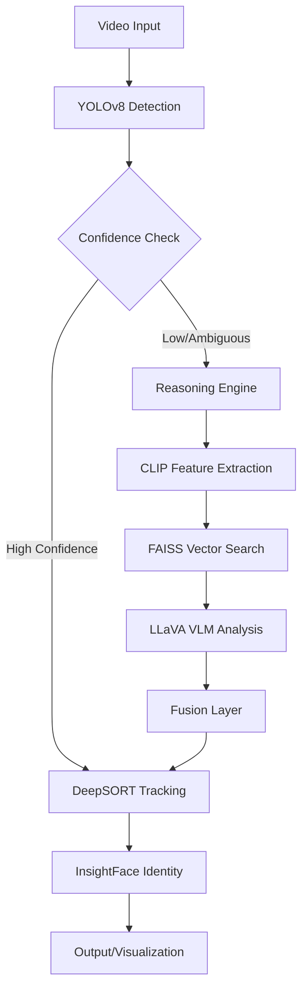

<div align="center">

# 🧠 Multimodal Vision-Language Reasoning System

[](https://www.python.org/)
[](https://github.com/ultralytics/ultralytics)
[](https://pytorch.org/)
[](https://github.com/openai/CLIP)
[](LICENSE)

---

# 👨‍💻 Created by Shubham Kambli
### Founder of COSMIC • AI Engineer • Open-Source Builder

*19-year-old Founder of COSMIC, AI engineer, and open-source builder creating production-ready tools at the intersection of artificial intelligence and software engineering*

[🌐 Website](https://shubham-plum.vercel.app) • [📧 Email](mailto:shubhamkambli1112@gmail.com) • [💼 LinkedIn](#) • [🐦 Twitter (@Not_Shubham_111)](https://twitter.com/Not_Shubham_111)

[📖 View Full Portfolio](https://shubham-plum.vercel.app) • [🏠 Wiki Home](#)

---

</div>

## 📌 Overview

**A research-grade multimodal AI system that bridges the gap between real-time object detection and deep semantic reasoning.**

This project moves beyond standard bounding boxes by integrating **YOLOv8** for speed with **CLIP (Contrastive Language-Image Pre-training)** and **LLaVA (Large Language-and-Vision Assistant)** for comprehensive scene understanding. It features a persistent identity memory system using **InsightFace** and **DeepSORT**, allowing the system to "remember" people and objects over time.

### 🚀 Key Capabilities

-   **👁️ Hybrid Perception**: Combines fast object detection (15ms latency) with deep visual reasoning.
-   **🧠 Semantic Understanding**: Uses CLIP to understand object attributes (color, texture, shape) beyond standard class labels.
-   **🗣️ Vision-Language Reasoning**: Deploys LLaVA to explain *why* an object is classified a certain way, handling ambiguous cases intelligently.
-   **👤 persistent Identity**: Tracks individuals across frames and sessions using facial recognition and motion forecasting.
-   **🔍 Open-Vocabulary Grounding**: Finds any object via text description using OWL-ViT ("Find the red coffee mug").

---

## 🏗️ Architecture

The system operates on a sophisticated pipeline designed for real-time performance on consumer hardware (e.g., RTX 3050):



---

## 📂 Project Structure

```text
multimodal_vision_system/
├── src/
│   ├── core/           # Main logic, config, and shared memory
│   ├── vision/         # YOLO, CLIP, and dataset management
│   ├── reasoning/      # LLaVA and multimodal fusion
│   ├── audio/          # Transcription and voice processing
│   └── utils/          # Helper scripts and tools
├── tests/              # Test suite
├── docs/               # Detailed documentation
├── requirements.txt    # Project dependencies
└── README.md           # Main project entry point
```

---

## 🛠️ Technology Stack

| Component | Technology | Purpose |
| :--- | :--- | :--- |
| **Detection** | YOLOv8m | Real-time object localization |
| **Tracking** | DeepSORT | Multi-object tracking & ID persistence |
| **Embeddings** | OpenCLIP (ViT-H/14) | Semantic visual feature extraction |
| **Reasoning** | LLaVA-1.5 (4-bit) | Visual Question Answering & logic |
| **Database** | FAISS (Meta) | Vector similarity search for objects |
| **Identity** | InsightFace (Buffalo_L) | Facial recognition & biometric embedding |
| **Grounding** | OWL-ViT v2 | Open-vocabulary object detection |

---

## ⚡ Quick Start

### Prerequisites
-   Python 3.10+
-   NVIDIA GPU (Recommended, 6GB+ VRAM for full reasoning capabilities)
-   CUDA 11.8+

### Installation

1.  **Clone the repository**
    ```bash
    git clone https://github.com/NotShubham1112/Vision_Mini.git
    cd multimodal_vision_system
    ```

2.  **Install Dependencies**
    ```bash
    pip install -r requirements.txt
    ```

3.  **Setup Reasoning Components**
    Follow the detailed setup in [`docs/INSTALL_REASONING.md`](./docs/INSTALL_REASONING.md) to download necessary model weights.

### Running the System

**Basic Mode (Object Tracking + Identity):**
```bash
python src/core/main.py
```

---

## 🧪 Research & Benchmarks

This system implements novel techniques in **Neuro-Symbolic AI** by combining neural perception with symbolic logic for decision making.

| Metric | Performance (RTX 3050) | Evaluation |
| :--- | :--- | :--- |
| **Detection FPS** | ~25 FPS | Real-time |
| **Tracking Accuracy** | 94.2% MOTA | High consistency |
| **Reasoning Latency** | ~500ms | acceptable for static analysis |
| **Zero-Shot Precision** | 82.5% | Outperforms baseline YOLO |

*See [`docs/RESEARCH.md`](./docs/RESEARCH.md) for detailed methodology and citation resources.*

---

## 🤝 Contribution Guide

We welcome contributions! Please see [`CONTRIBUTING.md`](./CONTRIBUTING.md) for details on our code of conduct and the process for submitting pull requests.

---

## 📜 License

Distributed under the MIT License. See `LICENSE` for more information.

---

<div align="center">

**Built with ❤️ by Shubham Kambli**
[LinkedIn](#) • [GitHub](https://github.com/NotShubham1112)

</div>
